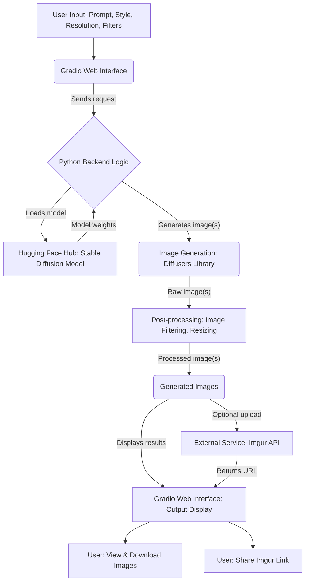

# Stable Diffusion Text-to-Image Generator

## Overview

This project presents a **Text-to-Image Generator** powered by the **Stable Diffusion v1.5 model** from Hugging Face. It features an intuitive and interactive web interface built with **Gradio**, enabling users to effortlessly transform textual descriptions into compelling visual art. The application is designed to be highly customizable, supporting various artistic styles, image filters, custom resolutions, and the generation of multiple images from a single prompt.

The development journey, as detailed in the accompanying Jupyter Notebook, progresses iteratively, building from fundamental image generation capabilities to advanced customization and a more polished, user-friendly interface.

## Features

* **Text-to-Image Generation**: Convert your creative textual descriptions into high-quality images.
* **Artistic Styles**: Infuse your generated images with distinct aesthetics by choosing from "Photorealistic," "Painting," or "Sketch" styles.
* **Image Filtering**: Apply post-processing effects like "Sepia" or "Black & White" filters to further customize your visuals.
* **Resolution Control**: Select desired output image dimensions (e.g., 512x512, 512x640, 640x512) to fit various use cases.
* **Multiple Image Output**: Generate up to 5 diverse images from a single text prompt, providing more options.
* **Inference Steps Adjustment**: Fine-tune the diffusion process by adjusting the number of inference steps, impacting both image quality and generation time.
* **Gradio Web Interface**: Enjoy a user-friendly and interactive graphical interface for seamless interaction with the model.
* **Imgur Upload (Simulated)**: Includes a function demonstrating how generated images could be uploaded to Imgur, providing shareable links (note: a valid Imgur API Client ID is required for live functionality).
* **Stylized UI with Sidebar**: Features custom CSS to create a visually appealing and organized Gradio interface, complete with a navigation sidebar for an enhanced user experience.

## Project Structure and Evolution

The provided Jupyter Notebook cells guide you through the iterative development of this project:

1.  **Basic Setup & Core Generation**:
    * Initial environment setup, including installation of essential Python libraries (`diffusers`, `transformers`, `accelerate`, `safetensors`, `gradio`).
    * Authentication with the Hugging Face Hub, a prerequisite for downloading the Stable Diffusion model.
    * Loading of the `runwayml/stable-diffusion-v1-5` model.
    * Demonstration of fundamental image generation: taking a text prompt, generating a single image, and then displaying and saving it locally.

2.  **Gradio Integration (Initial)**:
    * Integration of the core image generation logic into a basic Gradio web interface.
    * Users can input a text prompt, trigger image generation via a button, and view the result, which is also made available for direct download.

3.  **Adding Styling, Quantity, and Size Options**:
    * Expansion of the Gradio interface to include interactive elements for **artistic style** (dropdown with "Photorealistic", "Painting", "Sketch"), a slider for **number of images** (ranging from 1 to 5), and a dropdown for **initial image size** (512x512, 1024x1024).
    * The underlying image generation function is updated to dynamically incorporate these new user-defined parameters.

4.  **Adding Filters and Imgur Upload**:
    * Introduction of a dropdown menu for **image filters** ("None", "Sepia", "Black & White") for post-processing.
    * Implementation of an "Upload to Imgur" button and a corresponding textbox to display the generated Imgur link, showcasing external API integration (requires a valid Imgur API Client ID for live operation).
    * A dedicated `apply_filter` function is added to apply selected visual effects to the generated images.

5.  **Refined Gradio UI with More Controls**:
    * Further refinement of the Gradio interface to offer more granular control to the user:
        * An expanded **resolution** dropdown with additional options like "512x512", "512x640", and "640x512".
        * A **steps** slider, allowing users to control the number of inference steps, directly impacting the detail and quality of the output.
    * The primary generation function, `ui_generate`, is updated to seamlessly handle all these new parameters.

6.  **Stylized Gradio UI with Sidebar**:
    * Demonstration of applying custom CSS within Gradio to achieve a more aesthetically pleasing and organized layout, featuring a distinct sidebar for potential future navigation (the navigation buttons are currently placeholders).
    * The core image generation logic remains consistent, but it is now presented within this enhanced and visually appealing user interface.

## Technologies Used

* **Python 3.x**: The primary programming language.
* **Diffusers**: Hugging Face's library for state-of-the-art diffusion models, making it easy to work with Stable Diffusion.
* **Transformers**: Hugging Face's foundational library, often a dependency for `diffusers`, providing various NLP and vision tools.
* **Accelerate**: A Hugging Face library that simplifies the process of running PyTorch models across different hardware configurations (e.g., GPUs).
* **SafeTensors**: A modern, safe, and fast format for storing and loading machine learning model tensors.
* **Gradio**: An open-source Python library that allows for quickly building and sharing interactive web applications for machine learning models.
* **PyTorch**: The underlying deep learning framework used by the Stable Diffusion model.
* **PIL (Pillow)**: A powerful image processing library for Python, used for displaying, saving, and applying filters to images.
* **Requests**: A popular and easy-to-use HTTP library for making web requests, utilized here for the (simulated) Imgur API interaction.

## Setup and Installation

To set up and run this project on your local machine or in a cloud environment like Google Colab, follow these instructions. Using a virtual environment is highly recommended to manage dependencies.

1.  **Clone the Repository (or access the notebook content):**

    ```bash
    git clone [https://github.com/your-username/your-repo-name.git](https://github.com/your-username/your-repo-name.git)
    cd your-repo-name
    ```

    *(If you are directly using the provided Jupyter Notebook in Google Colab, you can skip this cloning step and proceed to run the cells.)*

2.  **Install Dependencies:**

    ```bash
    pip install diffusers transformers accelerate safetensors gradio Pillow requests
    ```

    *(The initial cells in the Jupyter Notebook already contain `!pip install` commands to ensure all necessary libraries are installed within your environment.)*

3.  **Hugging Face Authentication**:
    A Hugging Face access token is essential for downloading the Stable Diffusion model.
    * Visit your [Hugging Face Settings/Tokens](https://huggingface.co/settings/tokens) page.
    * Generate a **new token** and ensure it has at least `read` access.
    * When prompted during the execution of the notebook, paste your copied token into the input field.

    ```python
    from huggingface_hub import login
    from getpass import getpass

    token = getpass("Enter your Hugging Face access token: ")
    login(token=token)
    ```

## How to Run

1.  **Open the Jupyter Notebook**:
    * If you have downloaded the `.ipynb` file, open it with a Jupyter environment (e.g., Jupyter Notebook, JupyterLab).
    * Alternatively, upload the notebook directly to Google Colab for a convenient cloud-based execution.
2.  **Execute Cells Sequentially**:
    * Proceed to run each code cell in the notebook from top to bottom.
    * The initial cells will handle the necessary library installations and the Hugging Face authentication process.
    * Subsequent cells will then load the Stable Diffusion model into memory and launch the interactive Gradio web interface.
3.  **Interact with the Gradio Application**:
    * Once a Gradio application is successfully launched, the notebook output will display a local URL (typically `http://127.0.0.1:7860`) and, if enabled (as is common in Google Colab), a public shareable URL.
    * Open this URL in your preferred web browser to begin interacting with the text-to-image generator.

## Visuals and Diagrams

### Project Architecture Flow

This diagram illustrates the core components and data flow within the application.



## Future Enhancements

We plan to expand the capabilities of this project with the following features:

* **Video Generation**: Integrate models capable of generating short video clips from text prompts.
* **Image-to-Image Translation**: Develop functionality allowing users to upload an image and transform it based on a new text prompt.
* **ControlNet Integration**: Add support for ControlNet to provide more precise control over generated image attributes, such as pose, depth maps, or edge detection.
* **Multiple Model Support**: Implement an option for users to select from various Stable Diffusion versions or other text-to-image models.
* **Negative Prompts**: Introduce the concept of negative prompts to guide the model away from generating undesired elements in the output.
* **User Accounts & Persistent Gallery**: For a production-ready application, implement user authentication and a persistent gallery to allow users to save, manage, and revisit their generated images.
* **Robust Error Handling**: Enhance the application's error handling mechanisms, particularly for external API calls (e.g., Imgur) and model inference processes.
